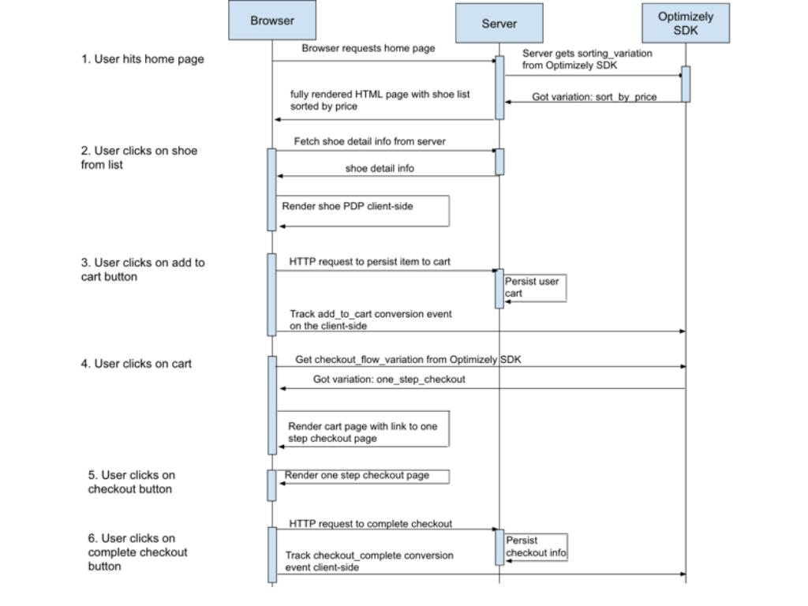

#Optimizely Isomorphic React Web App Demo

This demo node web app uses the Optimizely Node SDK and Javascript SDK for A/B Testing. The web app is built using React/Redux and is an isomorphic web app. All React components are shared between the server and client and can be rendered both on the server-side and on the frontend.

##Optimizely Full Stack Overview

Optimizely Full Stack allows developers to run experiments anywhere in their code! The Node and Javascript SDKs provides the core components to run a full stack experiment with Optimizely. It handles aspects like bucketing, which is used to designate users to a specific experiment variation, conversion tracking, and reporting via Optimizely’s [Stats Engine](https://www.optimizely.com/statistics/).

* View the [Javascript Getting Started Guide](http://developers.optimizely.com/server/getting-started/index.html?language=javascript)

* View the [Node Getting Started Guide](http://developers.optimizely.com/server/getting-started/index.html?language=node)

* View the reference [documentation](http://developers.optimizely.com/server/reference/index.html?language=node).

* Latest [Javascript SDK](https://github.com/optimizely/javascript-sdk)

* Latest [Node SDK](https://github.com/optimizely/node-sdk)

## Setting up the Optimizely Experiment

If you haven't yet, please sign up for an [Optimizely account](https://www.optimizely.com/) and create a Node Fullstack project. Once you have a project ID, replace it in the [enums file](./src/common/utils/enums.js).

Then, go to the [Optimizely X dashboard](https://app.optimizely.com) and create the following experiments along with their variations. These are the experiments that we are running and the goals we are tracking in our sample app:

1. sorting_experiment

  *Variations:*
  - sort_by_price
  - sort_by_name

  *Events:*
  - add_to_cart --> tracks when user adds a product to their cart

2. checkout_flow_experiment

  *Variations:*
  - one_step_checkout
  - two_step_checkout

  *Events:*
  - checkout_complete --> tracks when user clicks on the complete checkout button. We also track revenue amount of the cart.

Relevant files to look at are:

1. `src/server/routes/views.js` - This is where we compute application state using Optimizely experiment data and use it to hydrate our React components on the server-side. You can find the home page sorting logic here.

2. `src/common/action_creators/index.js` - This is where we track events on the client side.

3. `src/common/components/cart/index.js` - This is where we activate the checkout_flow experiment client-side and can be activated server-side too if we were to persist cart information.

## Sequence diagram

## How is Optimizely used

The experimentation logic is not instrumented in the React component themselves. Instead we determine the experiment variations before we computed the application state and use the experiment variations to massage the application state to reflect the experiments we are running. That said, the experimentation logic runs in our Redux code inside our *action_creators*. Additionally we store the experiment data in our Redux store so the React components can access the experiment data and render themselves accordingly.

## Configure Node version

Node v4.0.0 or higher is needed for compatibility with this demo app. Using [nvm](https://github.com/creationix/nvm) is recommended for installing and switching between versions of Node.

## Install the app

### Install NPM dependencies
`npm install`

### Build the assets
`webpack`

This builds the main.js file into the `public` directory

## Configure experiment
To run with your own project and experiments you can modify the keys inside of `src/common/utils/enums.js`

## Run the app
`npm start`

Visit [http://localhost:4242](http://localhost:4242)

## Getting Help!

* Developer Docs: http://developers.optimizely.com/server
* Questions? Shoot us an email at developers@optimizely.com